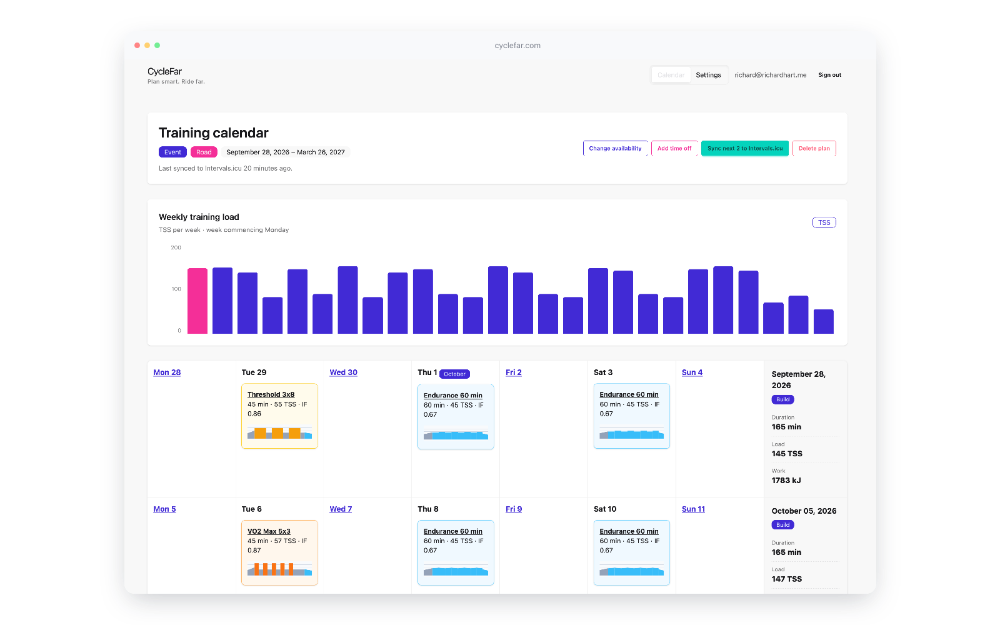

# CycleFar

CycleFar is a cycling training planner, live at <https://cyclefar.com>. It turns a rider's
goal, availability, FTP and target event into a deterministic training plan,
then keeps the calendar practical as training is completed, missed or changed.

The application is desktop-first and designed around a continuous weekly
calendar. Workout targets are stored as percentages of FTP, so future workouts
can adapt when FTP changes while completed workouts retain their historical
snapshots.



## What it includes

- Plan creation with a preview for general fitness, FTP, endurance,
  climbing and event goals.
- Email/password registration, sign-in, sign-out and password reset built on
  Rails-generated authentication, with independent rider accounts.
- A deterministic, versioned workout engine for endurance, tempo, Sweet Spot,
  threshold, VO2 max, over-under and recovery sessions.
- A continuous calendar with canonical main-set summaries, watt ranges,
  TSS/IF/work, event details, editable future workouts and inline power-profile
  graphs. Later outlines show their purpose; weekly totals feed a TSS chart.
- Generated weekly load limits, aligned recovery weeks
  and staged taper budgets that retain the target event and opener.
- Completion feedback, overdue and missed-workout resolution, and explicit
  adaptation proposals with owner-scoped before/after comparisons and a
  14-day target window. Proposals enforce seven-day expiry and reject stale
  inputs; accepted progression bias affects later generation.
- Availability changes, planned time off and a gradual return after illness or
  recovery time, with saved stage power limits and progression based on the
  latest comparable pre-break session.
- FTP history and recalculation of future workout watt targets without changing
  completed workouts.
- Manual Intervals.icu sync for the next two executable structured workouts.
  CycleFar only reconciles events that it owns.
- Archive and delete controls for a plan, plus an idempotent development seed
  for visual testing.

Profiles, plans, preview drafts and Intervals.icu sync records are scoped to
the signed-in user, and an integrated two-rider test matrix exercises those
boundaries. Riders can self-register from the public homepage. Operator
provisioning is disabled by default and requires an explicit environment flag;
the documented release process requires verifying live mail delivery first.
V1 has no ride imports, trainer control, notifications or automatic calendar syncing.

Each rider can have one active plan. Executable workouts for today through the
next 13 days gain detailed steps as the calendar is loaded; later workouts
retain outline prescriptions and forecast metrics. Explicit Add, Copy and Move
actions can also leave structured workouts outside that window. Due or overdue
outlines can be opened and completed individually, including event openers.

Initial endurance workouts select and save one of three profiles: sustained,
alternating or undulating. This is the engine's deliberate randomness exception;
previews and regeneration with an explicit variation remain deterministic.

## Local setup

The repository pins Ruby **4.0.6** and Rails **8.1.4**, and uses Tailwind CSS
with daisyUI, Hotwire/Turbo and Stimulus. Local setup requires Bundler, libvips
and a running PostgreSQL **17+** server with `psql` and `pg_dump` on `PATH`.
Your local PostgreSQL role must be
able to create the development and test databases. libvips supports the configured
Active Storage image-processing backend; CI installs its development package
before preparing Rails. Set `PGHOST`, `PGPORT`,
`PGUSER` and `PGPASSWORD` if your PostgreSQL installation needs them.

```sh
rbenv install -s 4.0.6
bundle install
bin/rails db:create db:schema:load
bin/setup --skip-server
bin/dev
```

The schema-load command is for a fresh database only. It initializes the
development and test databases without
running the optional demo seed, which requires an existing rider account.
For subsequent setup or updates, run `bin/setup --skip-server` and `bin/dev`
without repeating the schema load.

Open <http://localhost:3000>. `bin/setup` installs dependencies, creates local
Active Record Encryption keys, prepares the database and builds Tailwind CSS.
`bin/dev` runs Rails and the Tailwind watcher through Foreman, installing Foreman
if needed. Node.js is not required by the current asset setup.

Setup retains existing encryption keys and can be rerun to update the local
environment; it also clears logs and temporary files. Its `--reset` option
recreates the database and invokes seeds, so it currently encounters the same
existing-rider requirement; use the fresh-database path above for initial setup.

The encryption-key files in `config/` are ignored by Git. Keep them with any
local database backup: losing them prevents decryption of a saved Intervals.icu
API key.

After setup, open the homepage and choose **Register** to create
your rider account or **Sign In** if you already have one. The checked-in
`db/structure.sql` includes authentication and user ownership constraints.
Production password-reset delivery uses environment-configured SMTP; delivery
through a live provider is not recorded as verified in the project docs.
See the [account access guide](docs/ACCOUNT_ACCESS.md) for deployment settings.

## Development sample plan

In development, load a realistic 12-week Increase FTP / Road plan with Base
included, a 260 W FTP, and three hard weeks followed by one recovery week:

| Day | Duration | Intent |
| --- | --- | --- |
| Tuesday | 60 minutes | Intervals |
| Thursday | 90 minutes | Endurance |
| Saturday | 60 minutes | Intervals |
| Sunday | 120 minutes | Endurance |

```sh
CYCLEFAR_SEED_USER_EMAIL=rider@example.com bin/rails db:seed
```

Set the email to an existing local user. The seed starts the plan on the next
Monday and sets that rider's FTP to 260 W. It does nothing when the rider already
has an active plan, and it does not create an account or run in production.

## Working with Intervals.icu

Save an Intervals.icu API key in **Settings**, then use the calendar's manual
sync action. Sync exports only the next two structured workouts that can be
performed, including openers, and uses stable `cyclefar-workout-<id>` external
IDs. It exports fewer than two when fewer are eligible.
It neither imports rides nor changes unrelated Intervals.icu events.

Sync removes every tracked event owned by the rider outside the next-two set,
including missed/completed, past-moved, deleted and previous-plan workouts.
It saves owned identities before upload and retains cleanup metadata on failure
so another manual sync can retry safely. Completed local history stays frozen.
See the [integration guide](docs/INTERVALS_ICU.md) for reconciliation and
API-contract limits.

## Deployment

The application uses Kamal **2.12.0**, Docker and an external PostgreSQL server.
Production images are built and deployed from the developer's machine. GitHub
Actions runs validation only; it does not build production images or deploy.
The [Terraform guide](infra/README.md) and
[CloudFormation alternative](infra/cloudformation/README.md) provision AWS
infrastructure separately; use one infrastructure tool per environment.

`config/deploy.yml` reads host and registry details from the deploying machine's
environment. Runtime credentials are supplied through `.kamal/secrets`. Prepare
Docker, SSH access, a container registry and the production database before
deploying. The configuration uses `cyclefar.com` for TLS and password-reset links;
for your own instance, update both `proxy.host` and `CYCLEFAR_APP_HOST` in that file.

Create or update local Rails credentials with your editor configured:

```sh
bin/rails credentials:edit
```

Use [the credentials example](config/credentials.yml.enc.example) as the guide.
The current `.kamal/secrets` prefers exported environment variables and falls
back to `secret_key_base`, `kamal.registry_password`, `db.password` and
`active_record_encryption` values in that local encrypted file. Retain existing
production values when configuring an existing deployment. The encrypted
credentials file and its master key are ignored by Git.

Create a private `.env.deploy` in the repository root containing shell
assignments for these variables:

| Variable | Value |
| --- | --- |
| `CYCLEFAR_WEB_HOST` | Application server IP address or hostname |
| `CYCLEFAR_DB_HOST` | PostgreSQL/RDS endpoint |
| `KAMAL_REGISTRY_USER` | Registry username; also used in the image name |
| `KAMAL_SSH_KEY` | SSH key path; optional, defaults to `~/.ssh/id_ed25519` |
| `CYCLEFAR_MAIL_FROM` | Authorized sender address |
| `CYCLEFAR_SMTP_HOST` | SMTP server address |
| `CYCLEFAR_SMTP_USERNAME` | SMTP username |
| `CYCLEFAR_SMTP_PASSWORD` | SMTP password or provider token |
| `ACTIVE_RECORD_ENCRYPTION_PRIMARY_KEY` | Existing production primary key |
| `ACTIVE_RECORD_ENCRYPTION_DETERMINISTIC_KEY` | Existing production deterministic key |
| `ACTIVE_RECORD_ENCRYPTION_KEY_DERIVATION_SALT` | Existing production derivation salt |

For example, an assignment has the form `CYCLEFAR_WEB_HOST='your-server-address'`.
`.env.deploy` is ignored by Git and excluded from Docker builds. Start Docker on
the deploying machine, use a committed revision whose GitHub CI checks have
passed, and ensure the server permits SSH from that machine's IP address.
Restrict access to the environment file and load it explicitly when deploying
from the repository root:

```sh
chmod 600 .env.deploy
( set -a; source .env.deploy; set +a; bin/kamal deploy )
```

This command builds the image locally, pushes it to the registry, and deploys it
to the application server. The local SSH key stays in its file, referenced by
`KAMAL_SSH_KEY`; local SSH host trust uses `~/.ssh/known_hosts`. The GitHub-only
`SSH_PRIVATE_KEY` and `SSH_KNOWN_HOSTS` settings are not used.

For the first deployment to a prepared environment, use `bin/kamal setup` in
place of `bin/kamal deploy`. `set -a` exports the loaded assignments; the
subshell keeps them scoped to that command. Kamal fixes the database port to
`5432` and database username to `cyclefar`; SMTP defaults to port `587`.
Match those settings to your provisioned services, or adjust the deployment
configuration.

Keep the production encryption keys for the lifetime of stored Intervals.icu
API keys; replacing them makes existing ciphertext unreadable. For a new
installation, generate one set with `bin/rails db:encryption:init` and retain it
in your secret store. Production password-reset delivery needs the Solid Queue
worker; Kamal enables its supervisor inside Puma. See the
[account access guide](docs/ACCOUNT_ACCESS.md) for mail and provisioning details.

Kamal supplies the running deployment version automatically. Pages display it
in a small footer: Git commit SHAs are shortened to seven characters, with the
full version available on hover. Custom versions and uncommitted-build markers
are shown in full. The footer is hidden when `KAMAL_VERSION` is absent, including
normal local development.

## Validation

```sh
bundle exec rspec
bin/rails zeitwerk:check
bin/rubocop
bin/brakeman --quiet --no-pager --exit-on-warn --exit-on-error
bin/bundler-audit
bin/importmap audit
```

`bin/ci` runs setup followed by these checks locally. GitHub Actions runs tests
against PostgreSQL 17, plus autoloading, lint and security checks. Intervals.icu
adapter specs stub HTTP rather than calling the live API.

## Documentation

- [Product overview](docs/PRODUCT.md)
- [Requirements](docs/REQUIREMENTS.md)
- [Training-engine rules](docs/TRAINING_ENGINE.md)
- [Architecture](docs/ARCHITECTURE.md)
- [Data model](docs/DATA_MODEL.md)
- [UX guide](docs/UX.md)
- [Architecture diagrams and rendering guide](docs/diagrams/README.md)
- [Intervals.icu adapter and reconciliation limits](docs/INTERVALS_ICU.md)
- [Account access and production mail](docs/ACCOUNT_ACCESS.md)
- [AWS infrastructure](infra/README.md) and [CloudFormation alternative](infra/cloudformation/README.md)
- [External references](docs/SOURCES.md)

Requirements and training rules describe intended V1 behaviour. Architecture,
data-model and UX implementation notes describe the current code and identify
remaining differences, including per-family progression bias and the proposed
workout modals and replacement previews. Calendar card fields,
stale linked Intervals.icu event cleanup, proposal expiry and stale-input checks
are implemented.

## License

CycleFar is released under the [MIT License](LICENSE).
